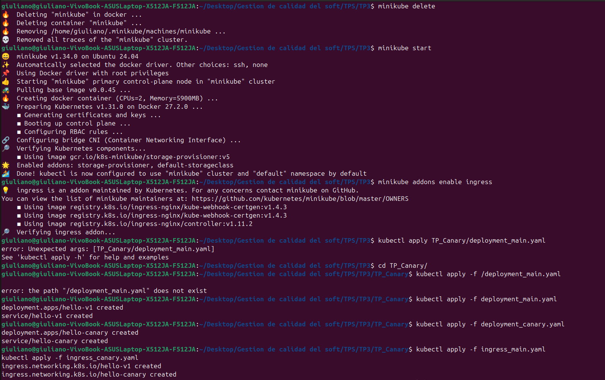

## Cansary with kubernetes
```bash
cd TP_Canary
minikube start
minikube addons enable ingress
minikube addons enable ingress
kubectl apply -f deployment_main.yaml 
kubectl apply -f deployment_canary.yaml 
kubectl apply -f ingress_main.yaml
kubectl apply -f ingress_canary.yaml
```



```bash
kubectl get ing
```


```bash
for i in $(seq 1 50); do curl -s http://hello-app.local | grep "Hostname"; done | sort | uniq -c

for i in $(seq 1 10); do curl -s http://hello-app.local | grep "Hostname"; done
```


En la imagen anterior se observa que se cumple el 10% del trafico para canary y el 90% para la v1.