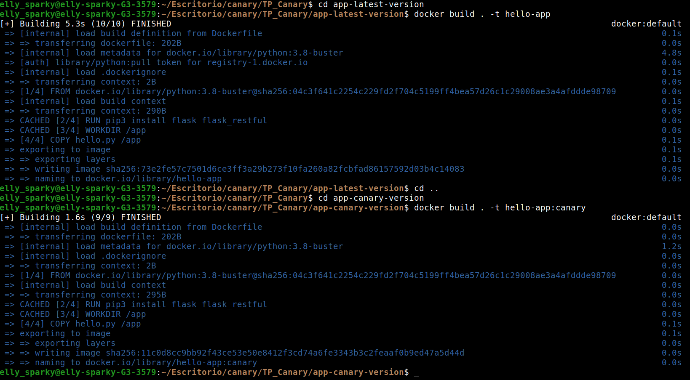
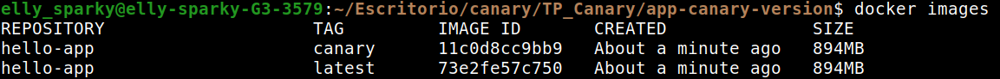
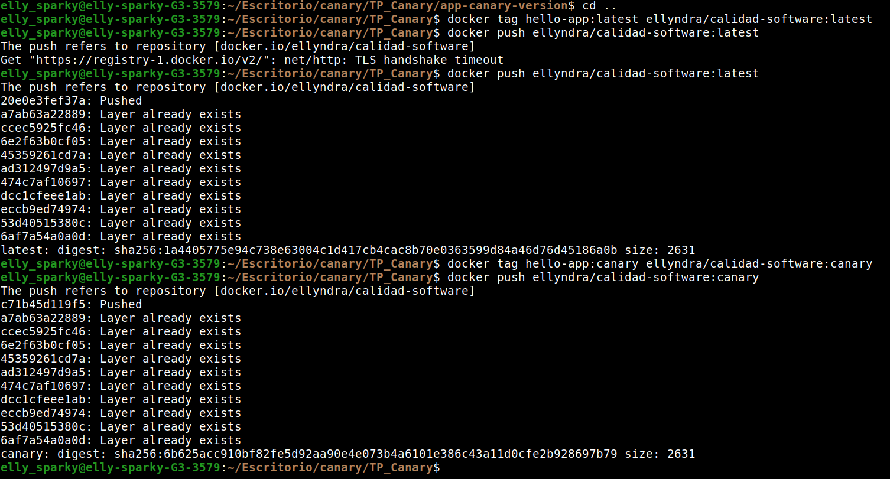
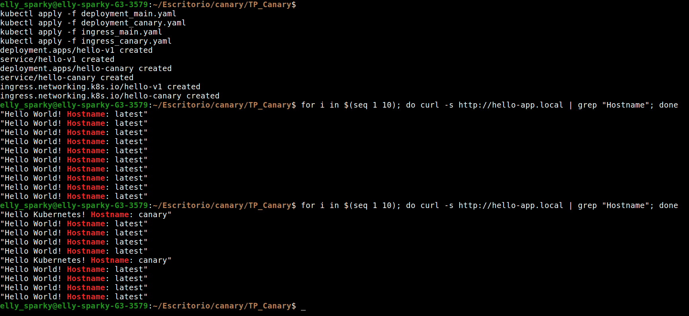

# Contenedor personalizado

Si se quieren utilizar contenedores propios, primero se debe crear una cuenta en [docker hub](https://hub.docker.com/). Una vez creada la cuenta se debe crear un nuevo repositorio público.

En el archivo "deployment_main.yaml" completar el valor de "image" a "image: <DOCKER_UB_USERNAME>/<REPOSITORY_NAME>:latest, en nuestro ejemplo usamos "image: ellyndra/calidad-software:latest".

En el archivo "deployment_canary.yaml" cambiar el valor de "image" a "image: <DOCKER_UB_USERNAME>/<REPOSITORY_NAME>:canary.

En las carpetas "app-latest-varsion" y "app-canary-version" se encuentran las distintas versiones de nuestra aplicación. En nuestro caso utilizamos una aplicación "hello world" web de python, en caso de querer trabajar con otro tipo de aplicación se deberá investigar sobre como corregir los archivos Dockerfile que permiten hacer la imagen docker.

Una vez terminados estos pasos debemos construir los contenedores:

```
cd app-latest-version
docker build . -t hello-app
cd ..

cd app-canary-version
docker build . -t hello-app:canary
```



Notese que en la versión lates no es necesario agregar la versión en el nombre del contenedor. Podemos verificar que se hayan creado correctamente con el comando ``` docker images ```



Ahora para subir las imágenes al repositorio de docker hub debemos ejecutar:

```
docker login
docker tag hello-app:latest <DOCKER_UB_USERNAME>/<REPOSITORY_NAME>:latest
docker push <DOCKER_UB_USERNAME>/<REPOSITORY_NAME>:latest
docker tag hello-app:canary <DOCKER_UB_USERNAME>/<REPOSITORY_NAME>:canary
docker push <DOCKER_UB_USERNAME>/<REPOSITORY_NAME>:canary
```



Por último iniciamos los pods, servicios e ingress de kubernetes:

```
kubectl appply -f deployment_main.yaml
kubectl appply -f deployment_canary.yaml
kubectl appply -f ingress_main.yaml
kubectl appply -f ingress_canary.yaml
```



Si se utilizó el código de python de ejemplo la versión latest imprimirá *Hello World! Hostname: latest* y la canary imprimirá *Hello Kubernetes! Hostname:canary*